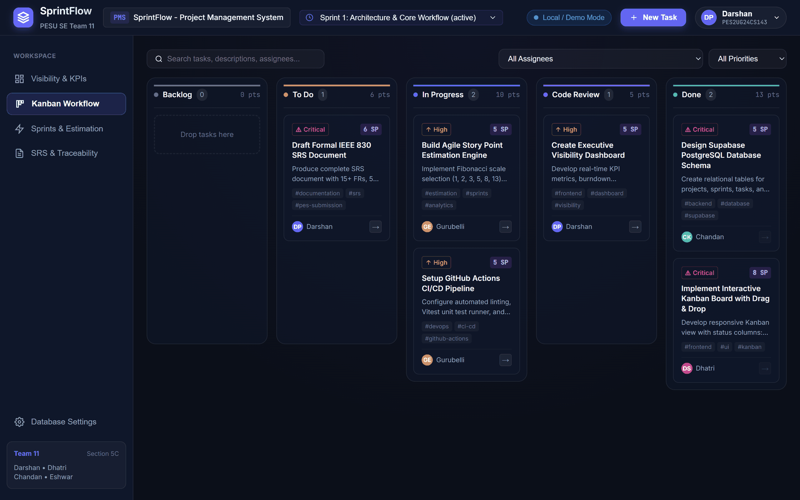
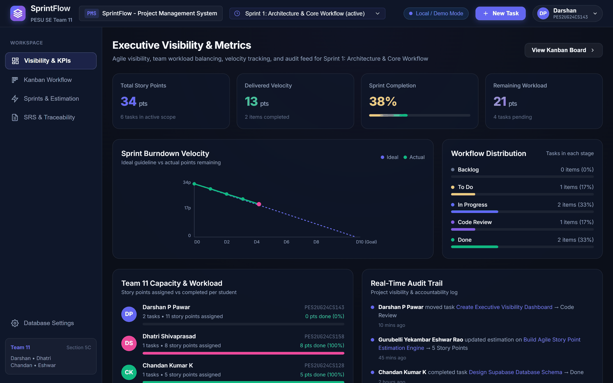
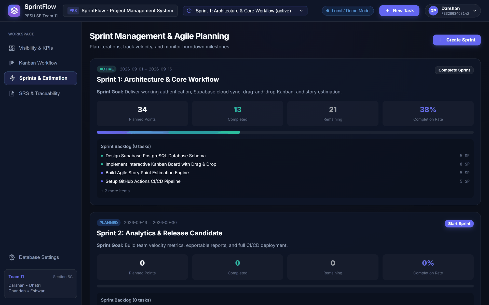
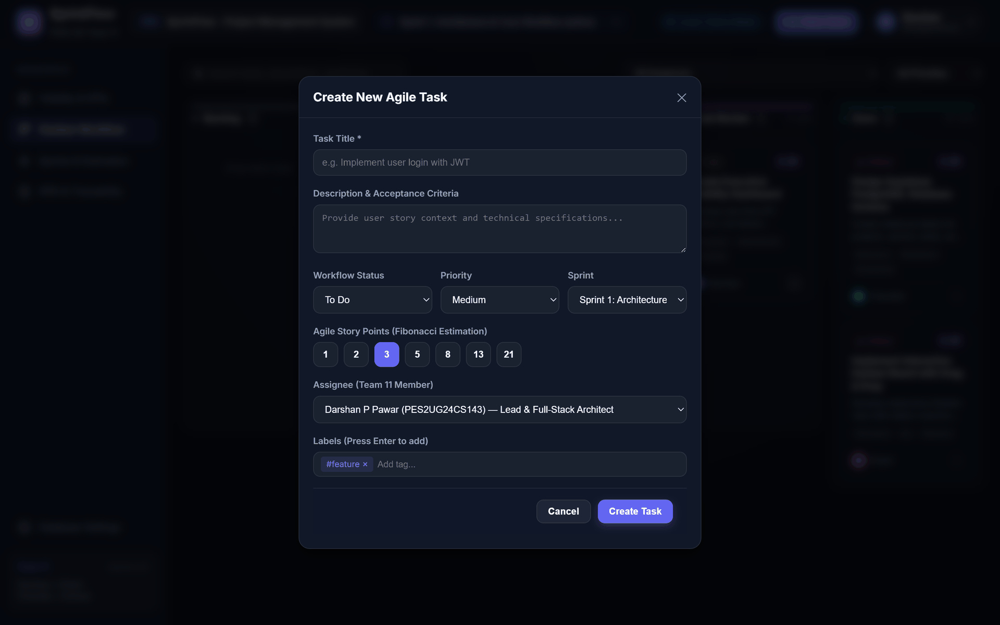
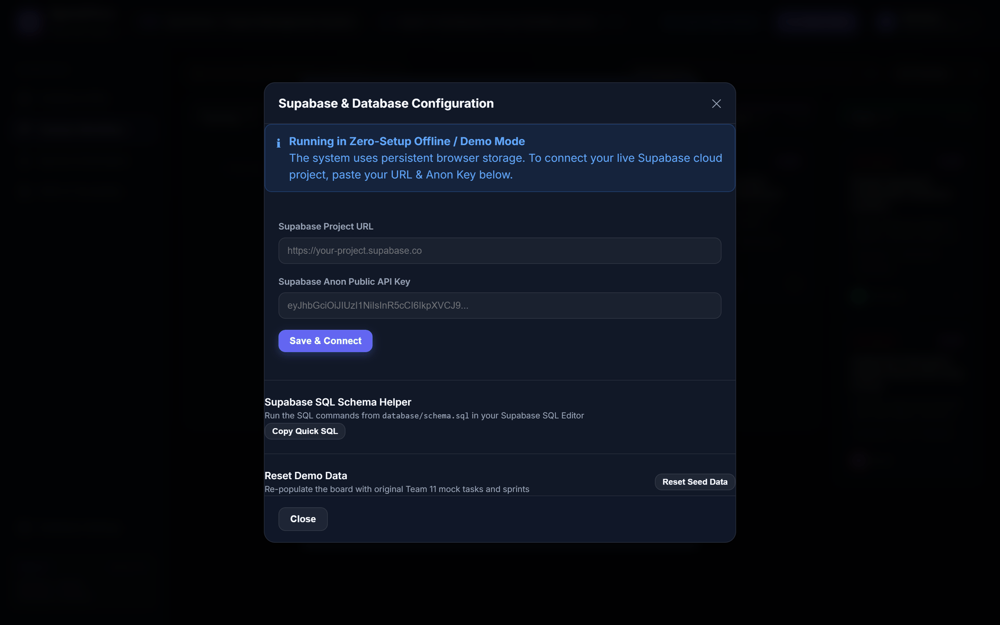

# Application Screenshots

## SprintFlow -- Project Management System

**Team 11 | Section 5C | PES University**
**Related Document:** `docs/SRS_Document_Team11.md`

---

## 1. Purpose

This document provides visual evidence that the requirements specified in the Software
Requirements Specification are implemented in working software. Each screen is mapped to
the functional requirements it satisfies and the test cases that verify them, using the
identifiers from the SRS Requirements Traceability Matrix.

## 2. Capture Conditions

| Property | Value |
| :--- | :--- |
| Build | Vite 5 production build (`npm run build`), served via `npm run preview` |
| Browser | Chrome, headless |
| Viewport | 1440 x 900 logical pixels, captured at 2x and downscaled to 1920 x 1200 |
| Data mode | Zero-configuration offline mode, no Supabase credentials supplied |
| Data source | Seed dataset from `src/services/mockData.js` |

All screenshots were taken with no database configured, demonstrating that the application
is fully functional without any setup step. This is the state an evaluator sees
immediately after `npm run dev`.

---

## 3. Kanban Workflow Board

The default view after launch. Five workflow columns are rendered in lifecycle order, each
with a task count and a story point subtotal. Cards carry a priority badge with a text
label, the story point estimate, categorization tags, and the assignee.

| Requirement | Description | Test Case |
| :--- | :--- | :--- |
| PMS-F-002 | Project metadata (name, active sprint) shown in the top bar | TC-PROJ-01 |
| PMS-F-003 | 5-column Kanban board matching lifecycle stages | TC-KAN-01 |
| PMS-F-004 | HTML5 drag-and-drop card movement | TC-KAN-02 |
| PMS-F-005 | 1-click stage advancement stepper (the arrow control on each card) | TC-KAN-03 |
| PMS-F-007 | Categorization labels and tags on work items | TC-TASK-02 |
| PMS-F-017 | Multi-attribute filtering by assignee, priority and free-text query | TC-FILT-01 |

Visible detail: the Backlog column renders an explicit empty state ("Drop tasks here")
rather than appearing blank, so an empty column cannot be mistaken for missing data.

---

## 4. Executive Visibility Dashboard

The visibility surface required by the project brief. Four KPI cards report total story
points, delivered velocity, sprint completion percentage and remaining workload, with the
SVG burndown chart plotting the ideal guideline against actual points remaining.

| Requirement | Description | Test Case |
| :--- | :--- | :--- |
| PMS-F-009 | Total planned points and sprint completion percentage | TC-EST-02 |
| PMS-F-011 | SVG burndown velocity curve | TC-BURN-01 |
| PMS-F-012 | Executive dashboard widgets (Total Points, Velocity, Progress) | TC-DASH-01 |
| PMS-F-013 | Student workload distribution and capacity balancing | TC-WORK-01 |
| PMS-F-014 | Immutable audit trail of entity state mutations | TC-LOG-01 |

The figures are internally consistent, which is what TC-BURN-01 verifies: 34 total story
points, 13 delivered, and the actual burndown line terminating at 21 points remaining,
matching the Remaining Workload card exactly. The chart is computed from live sprint
state, so completing a task lowers the actual line.

The Real-Time Audit Trail on the right evidences PMS-F-014: each mutation is recorded with
the acting team member, the affected entity, the transition, and a timestamp.

---

## 5. Sprint Management and Estimation

Sprint lifecycle management: creation with name, goal and date range, state progression
through planned, active and completed, and capacity totals derived from the Fibonacci
story points of assigned tasks.

| Requirement | Description | Test Case |
| :--- | :--- | :--- |
| PMS-F-009 | Dynamic capacity and completion computation | TC-EST-02 |
| PMS-F-010 | Sprint lifecycle states: planned, active, completed | TC-SPR-01 |

---

## 6. Task Creation and Fibonacci Estimation

The task dialog, used for both creation and editing so a single validation path serves
both. Title is required; description, assignee and labels are optional.

| Requirement | Description | Test Case |
| :--- | :--- | :--- |
| PMS-F-006 | Create and update tasks with title, description and priority | TC-TASK-01 |
| PMS-F-007 | Categorization labels and tags | TC-TASK-02 |
| PMS-F-008 | Fibonacci story point scale (1, 2, 3, 5, 8, 13, 21) | TC-EST-01 |

Note the story point control: the seven Fibonacci values are presented as fixed choices
rather than a free numeric input. An invalid estimate is therefore unrepresentable in the
interface rather than being accepted and rejected afterwards. This is how PMS-F-008 is
enforced at the point of entry, and what TC-EST-01 verifies.

---

## 7. Database Configuration

The dual-mode data layer. The panel states plainly which mode is active, so the user
always knows where their data is stored.

| Requirement | Description | Test Case |
| :--- | :--- | :--- |
| PMS-F-015 | Synchronisation with Supabase Cloud PostgreSQL | TC-SUPA-01 |
| PMS-F-016 | Transparent offline operation when no cloud keys are configured | TC-OFF-01 |

The banner confirms the system is running in zero-setup offline mode on persistent browser
storage. Supplying a Project URL and anon key switches the `DataService` abstraction to
Supabase PostgreSQL with no change at the call sites.

Only the anonymous public key is accepted here. Authorisation is enforced by PostgreSQL
Row Level Security at the database tier (PMS-SR-001), not in client code, because the anon
key is public by design and any client-side check could be bypassed with a direct API
call.

---

## 8. Coverage Summary

| Screen | Requirements Evidenced |
| :--- | :--- |
| Kanban board | PMS-F-002, 003, 004, 005, 007, 017 |
| Executive dashboard | PMS-F-009, 011, 012, 013, 014 |
| Sprint manager | PMS-F-009, 010 |
| Task modal | PMS-F-006, 007, 008 |
| Database settings | PMS-F-015, 016 |

Sixteen of the eighteen functional requirements are visible across these five screens. The
remaining two are demonstrated elsewhere: PMS-F-001 (authentication and profile switching)
is shown live through the profile control in the top bar, and PMS-F-018 (CI/CD automation)
is evidenced by the GitHub Actions run history on the repository rather than by the user
interface.

The cloud-connected half of PMS-F-015 also requires a live Supabase project, so only its
offline path is evidenced above.
